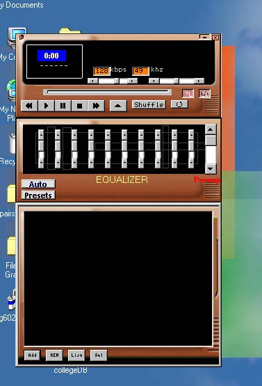



## JamminMp3

### Description

This is a full Mp3 Player with a playlist and skins. It also saves the last playlist you had when the program was running and it loads it when you run it again.... I created some skins and you can change them.. There are also examples of working with ini files
 
### More Info
 

             |
---                |---
**Submitted On**   |2000-08-09 20:48:46
**By**             |[Tolinio Christodoulou](https://github.com/Planet-Source-Code/PSCIndex/blob/master/ByAuthor/tolinio-christodoulou.md)
**Level**          |Intermediate
**User Rating**    |4.0 (16 globes from 4 users)
**Compatibility**  |VB 6\.0
**Category**       |[Sound/MP3](https://github.com/Planet-Source-Code/PSCIndex/blob/master/ByCategory/sound-mp3__1-45.md)
**World**          |[Visual Basic](https://github.com/Planet-Source-Code/PSCIndex/blob/master/ByWorld/visual-basic.md)
**Archive File**   |[CODE\_UPLOAD8813892000\.zip](https://github.com/Planet-Source-Code/tolinio-christodoulou-jamminmp3__1-10575/archive/master.zip)

### API Declarations

You can see everything in the zip file

